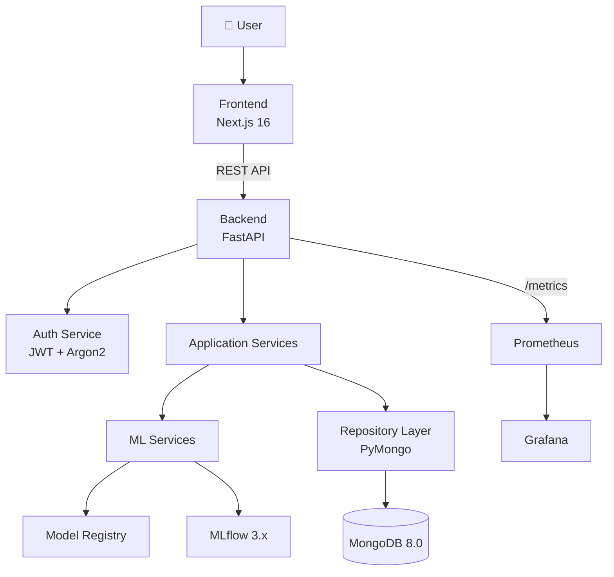
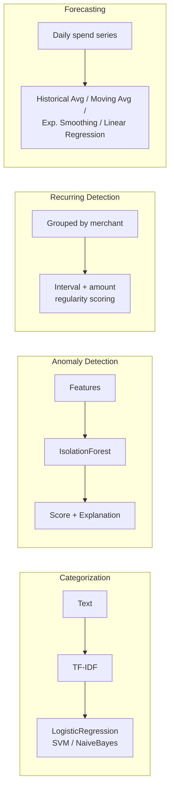

# 💰🧠 Finance Intelligence Platform

*Personal Finance Intelligence & Anomaly Detection Platform*


## Overview

The Finance Intelligence Platform is a **production-grade, open-source ML-powered solution** for personal finance analytics. Users upload bank transaction CSV files, and the system automatically categorizes transactions, detects spending anomalies, identifies recurring payments, forecasts future expenses, and generates actionable financial insights.

Built with modern engineering practices, this project goes far beyond a tutorial or proof-of-concept. It implements a **modular monolith architecture** with a high-performance Python/FastAPI backend, a sleek React/Next.js frontend, rigorous MLOps standards with MLflow, secure JWT + Argon2 authentication, scalable NoSQL data modeling with MongoDB, and comprehensive observability via Prometheus and Grafana.

> **Note**: This is a serious ML engineering portfolio project — not a notebook, not a toy, not a tutorial. Every component is fully implemented and production-ready.

*Dashboard screenshot coming in Phase 9*

---

## ✨ Features

> Status reflects the roadmap below — unchecked items are designed but not yet implemented.

- ✅ User authentication (JWT + Argon2id)
- ✅ CSV transaction import with flexible schema mapping
- ✅ ML-powered transaction categorization (TF-IDF + LogisticRegression/LinearSVC/MultinomialNB, best-of-3 by macro-F1)
- ✅ Anomaly detection with explainable reasons (Isolation Forest)
- ✅ Recurring payment detection (deterministic interval/amount-regularity scoring)
- ✅ Expense forecasting (7/30/90 days, best-of-4 classical baselines)
- ✅ Financial insights engine (deterministic, no LLM)
- ✅ Category management (system defaults + user-custom)
- ✅ RESTful API with OpenAPI/Swagger documentation
- ✅ React dashboard wired to the live API — auth, transactions, anomalies, recurring, forecast, insights, categories, analytics
- ✅ MLflow experiment tracking & model registry
- ✅ Model versioning with promotion rules
- ✅ Prometheus metrics + Grafana dashboard + health/readiness checks
- ✅ Docker Compose single-command deployment
- ✅ Automated testing (unit + API + ML, across all implemented phases)
- ⬜ CI/CD pipeline (GitHub Actions) — workflow scaffolding exists, not yet wired to this backend
- ✅ 100% free & open-source — no paid APIs or services

---

## 🏗️ Architecture



### Design Philosophy

**Modular Monolith** — A single FastAPI backend process with clearly separated layers:

```
Routes → Services → Repositories → MongoDB
                ↘ ML Services → Model Registry / MLflow
```

ML code lives in its own `ml/` package, invoked by services — never directly from routes.

---

## 🤖 ML Architecture



| Pipeline | Algorithm | Key Features |
|---|---|---|
| **Categorization** | TF-IDF → LogisticRegression (baseline), LinearSVC, MultinomialNB — best-of-3 by macro-F1 | Transaction description text |
| **Anomaly Detection** | Isolation Forest (unsupervised), fit per user | Amount deviation, frequency, merchant/category patterns, temporal features |
| **Recurring Detection** | Deterministic statistical grouping (no trained model) | Interval regularity, amount regularity, occurrence count → confidence score |
| **Forecasting** | Historical average, moving average, exponential smoothing, linear regression — best-of-4 by time-aware holdout MAE | Daily aggregated debit totals per user |

> Recurring-payment detection has no MLflow/registry entry by design — it's deterministic grouping logic (master-prompt Rule 6 lists it separately from the three registry-backed pipelines above), same as the insights engine.

---

## 📁 Project Structure

```text
ML_Project/
├── backend/                        # Python FastAPI Backend
│   ├── app/
│   │   ├── main.py                 # App factory + lifespan
│   │   ├── config.py               # Pydantic settings
│   │   ├── database.py             # MongoDB connection manager
│   │   ├── dependencies.py         # FastAPI DI
│   │   ├── exceptions.py           # Custom exceptions
│   │   ├── api/v1/                 # Versioned API routes (auth, users so far)
│   │   ├── schemas/                # Request/response schemas
│   │   ├── models/                 # MongoDB document models
│   │   ├── repositories/           # Data access layer
│   │   ├── services/               # Business logic
│   │   ├── middleware/             # CORS, logging, errors
│   │   └── utils/                  # Security, CSV, dates
│   ├── tests/                      # pytest test suites
│   ├── pyproject.toml
│   ├── requirements.txt
│   └── Dockerfile
├── frontend/                       # Next.js 16 Frontend
│   ├── src/
│   │   ├── app/                    # App Router pages
│   │   ├── components/             # UI components
│   │   ├── lib/                    # API client, utils
│   │   └── types/                  # TypeScript interfaces
│   ├── package.json
│   └── Dockerfile
├── ml/                             # Machine Learning Module
│   ├── categorization/             # Transaction classifier
│   ├── anomaly_detection/          # Anomaly detector
│   ├── forecasting/                # Expense forecaster
│   ├── preprocessing/              # Data cleaning
│   ├── features/                   # Feature engineering
│   ├── pipelines/                  # Training pipelines
│   ├── registry/                   # Model versioning
│   └── common/                     # Shared ML config
├── scripts/                        # Utility scripts
│   ├── create_indexes.py           # MongoDB index setup
│   ├── generate_sample_data.py     # Synthetic data generator
│   ├── seed.py                     # Demo data seeder
│   └── database/                   # DB migration scripts
├── monitoring/                     # Observability
│   ├── prometheus/                 # Prometheus config
│   └── grafana/                    # Grafana dashboards
├── models/                         # Saved ML model artifacts
├── data/sample/                    # Sample datasets
├── .github/workflows/ci.yml        # GitHub Actions CI
├── docker-compose.yml              # Full stack orchestration
├── Makefile                        # Developer commands
├── .env.example                    # Environment template
└── README.md
```

---

## 🛠️ Tech Stack

| Layer | Technology | Purpose |
|---|---|---|
| **API Framework** | FastAPI 0.115+ | Async REST API with automatic OpenAPI docs |
| **Database** | MongoDB 8.0 (Community) | Document storage for transactions & analytics |
| **DB Driver** | PyMongo 4.x | Official MongoDB driver |
| **Validation** | Pydantic v2 | Request/response/document validation |
| **Auth** | PyJWT + pwdlib[argon2] | JWT tokens + Argon2id password hashing |
| **ML - Classification** | scikit-learn (TF-IDF + LR) | Transaction categorization |
| **ML - Anomaly** | scikit-learn (IsolationForest) | Unsupervised anomaly detection |
| **ML - Forecasting** | NumPy + scikit-learn (classical baselines, time-aware selection) | Expense prediction |
| **ML - Boosting** | XGBoost 3.x | Available for categorization comparison |
| **Experiment Tracking** | MLflow 3.x | Params, metrics, artifacts, model registry |
| **Frontend** | Next.js 16 (App Router) | TypeScript, React 19, SSR |
| **Charts** | Recharts | Responsive, composable charts |
| **Monitoring** | Prometheus + Grafana | Metrics collection & dashboards |
| **Testing** | pytest + httpx | Unit, API, integration, ML tests |
| **Code Quality** | Ruff + mypy | Linting, formatting, type checking |
| **CI/CD** | GitHub Actions | Automated lint, test, build pipeline |
| **Infrastructure** | Docker + Docker Compose | Containerized local deployment |

---

## 📋 Prerequisites

- **Docker & Docker Compose** (recommended for quickest start)
- **Python 3.12+** (for local backend development)
- **Node.js 22+** (for local frontend development)
- **Git**

---

## 🚀 Quick Start

```bash
# 1. Clone the repository
git clone https://github.com/yourusername/finance-intelligence-platform.git
cd finance-intelligence-platform

# 2. Configure environment
cp .env.example .env

# 3. Start everything
docker compose up --build

# 4. Access the platform
# Frontend Dashboard:  http://localhost:3000
# Backend API Docs:    http://localhost:8000/docs
# Health Check:        http://localhost:8000/health
# MLflow UI:           http://localhost:5000
# Prometheus:          http://localhost:9090
# Grafana:             http://localhost:3001 (admin/admin)
```

---

## 💻 Local Development

### Backend

```bash
cd backend
python -m venv venv
venv\Scripts\activate          # Windows
# source venv/bin/activate     # macOS/Linux
pip install -r requirements-dev.txt
uvicorn app.main:app --reload --host 0.0.0.0 --port 8000
```

### Frontend

```bash
cd frontend
npm install
npm run dev
```

### MongoDB (standalone)

```bash
docker run -d -p 27017:27017 --name finance-mongo mongodb/mongodb-community-server:8.0
```

---

## 🎞️ Demo Data & Seeding

To see the dashboard populated immediately instead of starting from an empty account:

```bash
# 1. Make sure indexes exist and (ideally) models are trained first
make db-init
make generate-data   # synthetic labeled datasets for all 3 ML models
make train           # trains + registers categorization, anomaly, forecasting models

# 2. Create a demo user and import ~180 days of realistic synthetic transactions
make seed
```

`make seed` (`scripts/seed.py`) creates a demo user (`demo@example.com` / `DemoPass123!` by default), generates a realistic synthetic bank-export CSV via `scripts/generate_sample_data.py` (salary, rent, subscriptions, day-to-day spending with weekend seasonality, and a couple of injected large one-off "anomalies"), and imports it through the *real* `POST /api/v1/imports` pipeline — so categorization, anomaly detection, recurring detection, forecasting, and insights all populate the same way they would for a real user upload (master-prompt Rule 39). Running `make seed` again reuses the existing demo user and safely no-ops on the duplicate-file check rather than doubling the data.

`scripts/generate_sample_data.py` can also be run standalone to produce multiple users' CSVs under `data/sample/`, e.g. for manually testing the upload flow:

```bash
python -m scripts.generate_sample_data --users 5 --days 240
```

---

## ⚙️ Environment Variables

| Variable | Description | Default |
|---|---|---|
| `APP_NAME` | Application display name | `Finance Intelligence Platform` |
| `APP_VERSION` | Application version | `1.0.0` |
| `DEBUG` | Enable debug mode | `false` |
| `ENVIRONMENT` | Runtime environment | `development` |
| `LOG_LEVEL` | Logging verbosity | `INFO` |
| `MONGODB_URI` | MongoDB connection string | `mongodb://mongodb:27017` |
| `MONGODB_DATABASE` | Database name | `finance_ml` |
| `MONGODB_MIN_POOL_SIZE` | Min connection pool size | `5` |
| `MONGODB_MAX_POOL_SIZE` | Max connection pool size | `50` |
| `JWT_SECRET_KEY` | JWT signing secret | `change-me-in-production` |
| `JWT_ALGORITHM` | JWT algorithm | `HS256` |
| `JWT_ACCESS_TOKEN_EXPIRE_MINUTES` | Token TTL in minutes | `30` |
| `MLFLOW_TRACKING_URI` | MLflow server URI | `http://mlflow:5000` |
| `CORS_ORIGINS` | Allowed CORS origins (JSON) | `["http://localhost:3000"]` |
| `MAX_UPLOAD_SIZE_MB` | Max CSV upload size | `10` |
| `NEXT_PUBLIC_API_URL` | Frontend → Backend URL | `http://localhost:8000` |

---

## 📡 API Documentation

Interactive Swagger UI: **http://localhost:8000/docs**

### Endpoint Groups

| Prefix | Description | Status |
|---|---|---|
| `/api/v1/auth` | Registration, login, logout | 🟢 Implemented |
| `/api/v1/users` | User profile management (`/me`) | 🟢 Implemented |
| `/api/v1/transactions` | Transaction list + get by id (filtering by category/type/import) | 🟢 Implemented |
| `/api/v1/imports` | CSV upload & import history | 🟢 Implemented |
| `/api/v1/categories` | Category management | 🟢 Implemented |
| `/api/v1/anomalies` | Anomaly detection results | 🟢 Implemented |
| `/api/v1/recurring` | Recurring payment detection | 🟢 Implemented |
| `/api/v1/forecasts` | Expense forecasting | 🟢 Implemented |
| `/api/v1/insights` | Financial insights | 🟢 Implemented |
| `/api/v1/ml` | Model registry status + on-demand categorization | 🟢 Implemented |

### Example: Health Check

```bash
curl http://localhost:8000/health
# {"status":"healthy","mongodb":"connected","version":"1.0.0"}
```

---

## 🗄️ MongoDB Data Model

| Collection | Purpose | Status |
|---|---|---|
| `users` | User accounts with hashed passwords | 🟢 In use |
| `transactions` | Normalized financial transactions | 🟢 In use |
| `transaction_imports` | Import metadata & audit trail | 🟢 In use |
| `categories` | System + user-custom categories | 🟢 In use (defaults auto-seeded on startup) |
| `anomalies` | Detected anomaly records with explanations | 🟢 In use |
| `recurring_transactions` | Detected recurring payments | 🟢 In use |
| `expense_forecasts` | Forecasted spending by period | 🟢 In use |
| `ml_models` | Model registry metadata | 🟢 In use (file-based registry under `models/`, mirrored to MLflow) |
| `insights` | Generated financial insights | 🟢 In use |
| `audit_logs` | Security/action audit trail (TTL: 90 days) | ⚪ Planned — index exists, no writer yet |

All collections have purpose-designed indexes defined in `scripts/create_indexes.py` (idempotent, run via `make db-init`). `audit_logs` is the one collection with an index but no application code writing to it yet.

---

## 🔬 MLOps

- **MLflow Tracking**: `ml/categorization/train.py` logs every candidate model (params, metrics) to MLflow — defaults to a local SQLite-backed store (`mlflow.db`) so training works without Docker running; in Docker, `MLFLOW_TRACKING_URI` points at the real `mlflow` service.
- **Model Registry**: File-based registry under `models/<model_name>/<version>/` (model.joblib + metadata.json), with an `active.txt` pointer the backend reads to know which version to serve. Exposed via `GET /api/v1/ml/models`.
- **Promotion Rules**: A new version is only promoted to "active" if its macro-F1 is ≥ the currently active version's — see `ml.registry.model_registry.maybe_promote`. A bad retrain is saved to disk for inspection but never silently degrades what's being served.
- **Reproducibility**: Random seed fixed (42), dataset row counts and train/test split sizes recorded in each version's `metadata.json`, classification report and confusion matrix saved alongside the model.

---

## 🧪 Testing

```bash
# Run all tests with coverage
make test

# Or directly
cd backend && pytest tests/ -v --cov=app --cov-report=term-missing
```

| Category | What's Tested | Status |
|---|---|---|
| **Unit** | Password hashing, JWT lifecycle, CSV parsing, categorization service fallback, recurring-detection algorithm, insight-rule thresholds | 🟢 Covered |
| **API** | Auth, transactions, imports, categories, anomalies, recurring, forecasts, insights — including per-user data isolation and auth-guarding on every route | 🟢 Covered |
| **Integration** | CSV upload → parse → validate → MongoDB → categorize → detect anomalies → detect recurring → forecast → generate insights, end-to-end via TestClient | 🟢 Covered |
| **ML** | Dataset → train → registry → predict for all three models; promotion guardrail (won't promote a worse retrain); graceful behavior with no trained model; no-NaN/valid-schema predictions | 🟢 Covered |

> Exact test counts aren't quoted here since they drift with every phase — run `make test` / `make test-ml` for current numbers. Two stale test files from an earlier anomaly-detection draft (`ml/tests/_deprecated_*.py.bak`) were renamed out of pytest's discovery path rather than deleted, since the Filesystem tooling used to build this project can rename but not delete — safe to `git rm` them.

---

## 📊 Monitoring

- **Prometheus**: `/metrics` exposes HTTP request count and latency histograms; scrape config already points at `backend:8000`.
- **Grafana**: Auto-provisioned on startup — Prometheus is wired as the default datasource and a starter dashboard ("Finance Intelligence Platform - Overview": backend up/down, request rate, 5xx error rate, p50/p95/p99 latency, requests by endpoint and status code) loads automatically, no manual import needed. Open http://localhost:3001 (admin/admin) after `docker compose up`.
- **Health**: `/health` (liveness, reports MongoDB connectivity) and `/ready` (readiness, also reports which ML models are trained) endpoints are live.
- **Known limitation**: only HTTP-level metrics are instrumented today. Master-prompt Rule 28 also asks for ML-prediction-count/latency and CSV-import-count/failure counters — not yet added; the dashboard would need a couple of new panels once those counters exist in `app/main.py` / the ML services.

---

## 🔒 Security

**What the app does:**
- Argon2id password hashing (OWASP recommended, via `pwdlib`)
- JWT authentication with configurable expiry
- Pydantic input validation on all endpoints
- CORS configuration
- Safe MongoDB query construction (parameterized via PyMongo, no string-built queries)
- Environment-based secrets (never hardcoded)
- File upload size limits (`MAX_UPLOAD_SIZE_MB`) and `.csv`-only type validation on the imports endpoint

**What the app does NOT do:**
- ❌ Never stores bank credentials, UPI PINs, or CVVs
- ❌ Never requests authentication tokens for bank accounts
- ❌ Never provides certified financial advice

---

## 🗺️ Development Roadmap

| Phase | Description | Status |
|---|---|---|
| 1 | Architecture + Repository Setup | 🟢 Complete |
| 2 | Authentication + Database | 🟢 Complete |
| 3 | Transaction Import | 🟢 Complete |
| 4 | Categorization ML | 🟢 Complete |
| 5 | Anomaly Detection | 🟢 Complete |
| 6 | Recurring Payments | 🟢 Complete |
| 7 | Forecasting | 🟢 Complete |
| 8 | Insights Engine | 🟢 Complete |
| 9 | Frontend Dashboard | 🟢 Wired to the live API — auth, dashboard, transactions, anomalies, recurring, forecast, insights, categories, analytics pages all fetch real data |
| 10 | MLOps + Observability | 🟢 MLflow + Prometheus + Grafana (auto-provisioned dashboard) + health checks done; ML-specific metrics (prediction/import counters) still pending |
| 11 | CI/CD + Security | 🟡 CI now actually fails on lint/type/test/build errors (previously masked with `|| echo`), covers backend+ml+frontend; rate limiting still pending |
| 12 | Production Polish | 🟡 Sample data + seed script done; this README pass is part of it |

**Phase 2 deliverables completed:**
- `users` collection with unique-email index
- Argon2id password hashing, JWT issuance/verification
- `POST /api/v1/auth/register`, `POST /api/v1/auth/login`, `POST /api/v1/auth/logout`
- `GET /api/v1/users/me` (protected route)
- Repository layer (`UserRepository`) — no raw queries in routes
- 16 passing tests (5 unit, 11 API) covering registration, login, duplicate handling, token expiry/tampering, and auth-guarded routes

**Phase 3 deliverables completed:**
- Flexible CSV column mapper (`app/utils/csv_parser.py`) — recognizes common synonyms for date/description/amount/debit/credit/type/merchant/reference across different bank export formats, without assuming a fixed schema
- Row-level validation: a single malformed row (bad date, unparseable amount) is captured as an error and skipped — it never aborts the whole import
- Whole-file duplicate detection via SHA-256 file hash, checked against the `(user_id, file_hash)` unique index on `transaction_imports`
- `POST /api/v1/imports` (multipart CSV upload, `.csv`-only, size-limited via `MAX_UPLOAD_SIZE_MB`), `GET /api/v1/imports`, `GET /api/v1/imports/{id}`
- `GET /api/v1/transactions` (paginated, filterable by category/type/import id), `GET /api/v1/transactions/{id}` — both scoped to the authenticated user
- `TransactionRepository` / `TransactionImportRepository` — no raw queries in routes
- 21 new passing tests covering: successful import, duplicate rejection, non-CSV rejection, partial imports with row errors, debit/credit-column and amount+sign-inferred formats, missing required columns, per-user data isolation, and auth guarding
- **Not yet implemented:** transaction categorization is a placeholder (`category: "Uncategorized"` on every row) — real ML categorization is Phase 4

**Phase 4 deliverables completed:**
- Synthetic labeled dataset generator (`ml/datasets/generate_categorization_dataset.py`, `make generate-data`) — 17 default categories (Food, Groceries, Transportation, Travel, Shopping, Entertainment, Bills, Utilities, Healthcare, Education, Rent, Salary, Investment, Transfer, Subscription, Cash Withdrawal, Other), generic merchant names with UPI/POS/reference-number noise so the model generalizes past exact-string matching
- Shared text preprocessing (`ml/preprocessing/text_preprocessing.py`) used identically at train time and serve time — no train/serve skew
- `ml/categorization/train.py` — trains and compares TF-IDF + LogisticRegression, LinearSVC, and MultinomialNB; keeps whichever wins on macro-F1 (not accuracy, so rarer categories like "Rent" aren't hidden by "Food"/"Shopping" dominance); logs every candidate to MLflow
- `ml/categorization/evaluate.py` — standalone evaluation of any saved version against any labeled CSV
- `ml/categorization/predict.py` — inference-only `TransactionClassifier`, no training code in the serving path; handles both `predict_proba` (LogisticRegression/MultinomialNB) and `decision_function`-only (LinearSVC) models for confidence scoring
- `ml/registry/model_registry.py` — file-based versioned registry (`models/<model_name>/<version>/`), with a promotion guardrail: a retrain is only promoted to "active" if it's at least as good as production
- Backend integration: `app/services/categorization_service.py` wraps the `ml` package (works both in Docker, where `docker-compose.yml` already mounted `./ml` and `./models` into the backend container, and in local dev via a `sys.path` fallback); transaction import now assigns real `category` + `category_confidence` per row instead of the Phase 3 placeholder; falls back to `"Uncategorized"` gracefully if no model has been trained yet, rather than erroring
- `GET /api/v1/ml/models` (registry status), `POST /api/v1/ml/categorize` (on-demand categorization)
- 8 new `ml/` tests (dataset → train → registry → predict, promotion guardrail, graceful no-model fallback) + 5 new backend tests, run against a **real trained model** (not mocked) confirming end-to-end: `SWIGGY ORDER` → Food, `SALARY CREDIT` → Salary, `UBER RIDE` → Transportation
- **Honest caveat:** the bundled synthetic dataset has disjoint vocabulary per category, so it trains to 100% accuracy trivially — that number is a pipeline sanity check, not a real-world accuracy claim. Real bank exports will have messier, overlapping vocabulary; swap in real labeled data via `--dataset` for a meaningful evaluation.

**Phase 5 deliverables completed:**
- `ml/anomaly_detection/{train,evaluate,predict}.py` — Isolation Forest fit *per user* (a ₹5,000 grocery run is normal for one user and anomalous for another), using features from the shared `ml/features/transaction_features.py` module (amount deviation from the user's own category/merchant baselines, merchant novelty, day-of-week/day-of-month)
- Deterministic, feature-level explanations ("Amount is 4.2x higher than your usual spending in this category") generated from the same features that produced the score — never a canned string
- `app/services/anomaly_detection_service.py` re-scores a user's *entire* transaction history after every import (best-effort — a scoring failure never fails the import itself) and replaces that user's `anomalies` collection wholesale, since a new transaction can shift what "normal" looks like retroactively
- `GET /api/v1/anomalies`, `POST /api/v1/anomalies/detect` (manual re-scan), severity buckets (low/medium/high) — clearly labeled as *unusual*, never as confirmed fraud (master-prompt Rule 12)

**Phase 6 deliverables completed:**
- `app/services/recurring_detection_service.py` — no trained model; groups a user's debit transactions by merchant and classifies the median gap between consecutive charges into weekly/biweekly/monthly/quarterly/yearly buckets
- Confidence score combines *three* independent signals (interval regularity, amount regularity, occurrence count) specifically so a merchant appearing 3 times at random intervals/amounts doesn't get called "recurring" just because the name matched every time
- Auto re-scans after every import, same replace-wholesale pattern as anomalies
- `GET /api/v1/recurring`, `POST /api/v1/recurring/detect`

**Phase 7 deliverables completed:**
- `ml/forecasting/{methods,metrics,train,evaluate,predict}.py` — four classical baselines (historical average, moving average, exponential smoothing, linear regression) compared via **time-aware holdout** (last 14 days of each synthetic user's history, never seen during forecasting) on MAE/RMSE/MAPE; only the winner is registered
- Promotion rule adapted for a lower-is-better metric (MAE) without touching the shared registry's higher-is-better comparison used by categorization/anomaly detection
- Forecasts 7/30/90 days ahead from a user's actual daily debit totals (gap days filled with 0, never skipped); reports `"insufficient_data"` rather than a fabricated number below 14 days of history
- `GET /api/v1/forecasts`, `GET /api/v1/forecasts/{period}`, `POST /api/v1/forecasts/generate`

**Phase 8 deliverables completed:**
- `app/services/insights_engine.py` — six deterministic rules (category month-over-month increase, dominant category share, weekend-vs-weekday spending, largest single expense, three-consecutive-months-increasing, recurring payment count), each backed by a documented numeric threshold, not a vague heuristic
- No external LLM API — every message is built from the same transaction history already fetched for other services
- `app/api/v1/categories.py` — system-default categories (17, matching the categorization label set) auto-seeded on startup; users can add custom categories but cannot rename/delete defaults
- `GET /api/v1/insights`, `POST /api/v1/insights/generate`
- Both wired into the same post-import pipeline as anomalies/recurring/forecasts, run last since insights partly depend on the recurring count

---

## ❓ Troubleshooting

| Issue | Solution |
|---|---|
| MongoDB connection failed | Verify `MONGODB_URI` is correct and MongoDB container is healthy: `docker compose ps` |
| Port already in use | Change the conflicting port in `docker-compose.yml` or stop the conflicting process |
| Docker build fails | Ensure stable network, sufficient disk space, and Docker daemon is running |
| Frontend can't reach backend | Verify `NEXT_PUBLIC_API_URL=http://localhost:8000` in `.env` |
| MLflow not accessible | Check that port 5000 is free and the mlflow container is running |
| Backend fails to start with `ServerSelectionTimeoutError` | This is expected if MongoDB isn't running yet — the app fails fast on startup rather than serving with a broken DB connection. Start MongoDB first (`docker compose up mongodb` or the standalone `docker run` command above). |

---

## 🤝 Contributing

1. Fork the repository
2. Create a feature branch (`git checkout -b feature/amazing-feature`)
3. Write code with tests
4. Ensure linting passes (`make lint`)
5. Run tests (`make test`)
6. Push and open a Pull Request

---

## 📄 License

This project is licensed under the **MIT License** — see the [LICENSE](LICENSE) file for details.

---

## ⚠️ Disclaimer

**Financial Disclaimer**: This platform is strictly an **educational tool** and software engineering portfolio project. It is:

- **NOT** financial advice
- **NOT** a certified fraud detection system
- **NOT** a replacement for professional financial planning

Anomaly detection flags *unusual* transactions — it does **not** confirm fraud. All predictions and insights are statistical estimates and should not be the sole basis for financial decisions.
#
