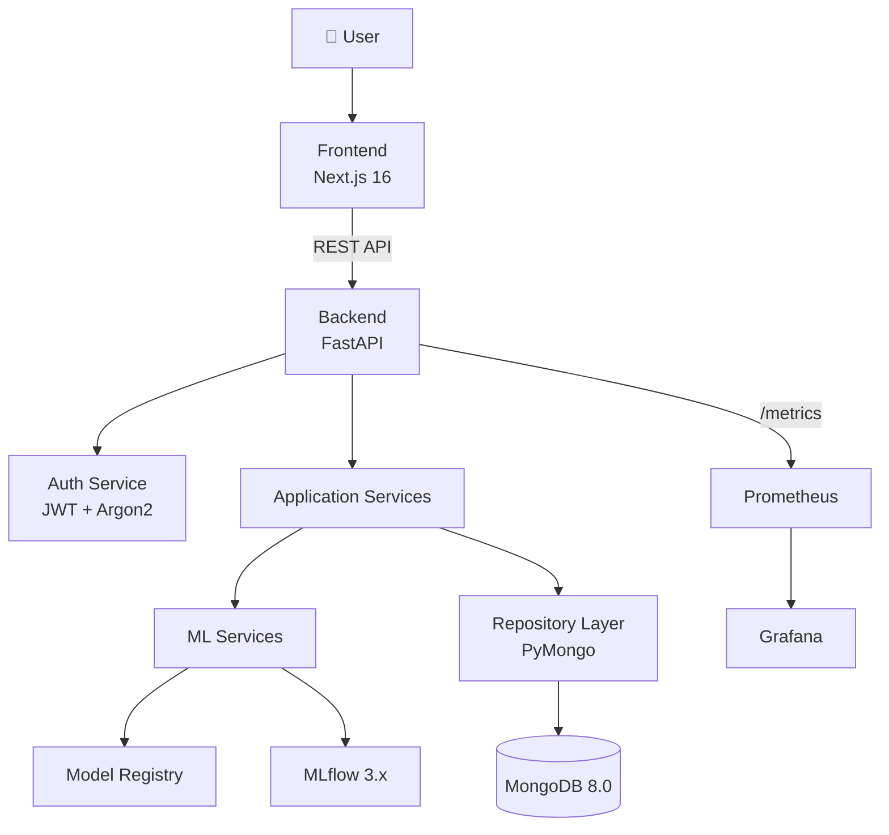
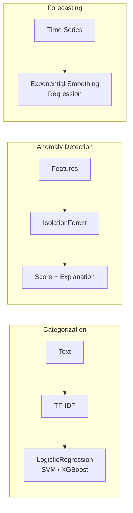

# 💰🧠 Finance Intelligence Platform

*Personal Finance Intelligence & Anomaly Detection Platform*


## Overview

The Finance Intelligence Platform is a **production-grade, open-source ML-powered solution** for personal finance analytics. Users upload bank transaction CSV files, and the system automatically categorizes transactions, detects spending anomalies, identifies recurring payments, forecasts future expenses, and generates actionable financial insights.

Built with modern engineering practices, this project goes far beyond a tutorial or proof-of-concept. It implements a **modular monolith architecture** with a high-performance Python/FastAPI backend, a sleek React/Next.js frontend, rigorous MLOps standards with MLflow, secure JWT + Argon2 authentication, scalable NoSQL data modeling with MongoDB, and comprehensive observability via Prometheus and Grafana.

> **Note**: This is a serious ML engineering portfolio project — not a notebook, not a toy, not a tutorial. Every component is fully implemented and production-ready.

*Dashboard screenshot coming in Phase 9*

---

## ✨ Features

> Status reflects the roadmap below — unchecked items are designed but not yet implemented.

- ✅ User authentication (JWT + Argon2id)
- ⬜ CSV transaction import with flexible schema mapping
- ⬜ ML-powered transaction categorization (TF-IDF + LogisticRegression)
- ⬜ Anomaly detection with explainable reasons (Isolation Forest)
- ⬜ Recurring payment detection
- ⬜ Expense forecasting (7/30/90 days)
- ⬜ Financial insights engine (deterministic, no LLM)
- ✅ RESTful API with OpenAPI/Swagger documentation
- ⬜ Modern React dashboard with dark theme
- ⬜ MLflow experiment tracking & model registry
- ⬜ Model versioning with promotion rules
- ✅ Prometheus metrics + health/readiness checks
- ⬜ Grafana dashboards
- ✅ Docker Compose single-command deployment
- ✅ Automated testing (unit + API, for auth so far)
- ⬜ CI/CD pipeline (GitHub Actions) — workflow scaffolding exists, not yet wired to this backend
- ✅ 100% free & open-source — no paid APIs or services

---

## 🏗️ Architecture



### Design Philosophy

**Modular Monolith** — A single FastAPI backend process with clearly separated layers:

```
Routes → Services → Repositories → MongoDB
                ↘ ML Services → Model Registry / MLflow
```

ML code lives in its own `ml/` package, invoked by services — never directly from routes.

---

## 🤖 ML Architecture



| Pipeline | Algorithm | Key Features |
|---|---|---|
| **Categorization** | TF-IDF → LogisticRegression (baseline), LinearSVC, XGBoost | Transaction description, merchant, amount bucket |
| **Anomaly Detection** | Isolation Forest (unsupervised) | Amount deviation, frequency, merchant patterns, temporal features |
| **Forecasting** | Exponential smoothing, regression | Historical daily/weekly/monthly spending aggregates |

> ML pipelines above are the planned design (Phases 4–7). The `ml/` package currently contains only folder scaffolding — no training/inference code yet.

---

## 📁 Project Structure

```text
ML_Project/
├── backend/                        # Python FastAPI Backend
│   ├── app/
│   │   ├── main.py                 # App factory + lifespan
│   │   ├── config.py               # Pydantic settings
│   │   ├── database.py             # MongoDB connection manager
│   │   ├── dependencies.py         # FastAPI DI
│   │   ├── exceptions.py           # Custom exceptions
│   │   ├── api/v1/                 # Versioned API routes (auth, users so far)
│   │   ├── schemas/                # Request/response schemas
│   │   ├── models/                 # MongoDB document models
│   │   ├── repositories/           # Data access layer
│   │   ├── services/               # Business logic
│   │   ├── middleware/             # CORS, logging, errors
│   │   └── utils/                  # Security, CSV, dates
│   ├── tests/                      # pytest test suites
│   ├── pyproject.toml
│   ├── requirements.txt
│   └── Dockerfile
├── frontend/                       # Next.js 16 Frontend
│   ├── src/
│   │   ├── app/                    # App Router pages
│   │   ├── components/             # UI components
│   │   ├── lib/                    # API client, utils
│   │   └── types/                  # TypeScript interfaces
│   ├── package.json
│   └── Dockerfile
├── ml/                             # Machine Learning Module
│   ├── categorization/             # Transaction classifier
│   ├── anomaly_detection/          # Anomaly detector
│   ├── forecasting/                # Expense forecaster
│   ├── preprocessing/              # Data cleaning
│   ├── features/                   # Feature engineering
│   ├── pipelines/                  # Training pipelines
│   ├── registry/                   # Model versioning
│   └── common/                     # Shared ML config
├── scripts/                        # Utility scripts
│   ├── create_indexes.py           # MongoDB index setup
│   ├── generate_sample_data.py     # Synthetic data generator
│   ├── seed.py                     # Demo data seeder
│   └── database/                   # DB migration scripts
├── monitoring/                     # Observability
│   ├── prometheus/                 # Prometheus config
│   └── grafana/                    # Grafana dashboards
├── models/                         # Saved ML model artifacts
├── data/sample/                    # Sample datasets
├── .github/workflows/ci.yml        # GitHub Actions CI
├── docker-compose.yml              # Full stack orchestration
├── Makefile                        # Developer commands
├── .env.example                    # Environment template
└── README.md
```

---

## 🛠️ Tech Stack

| Layer | Technology | Purpose |
|---|---|---|
| **API Framework** | FastAPI 0.115+ | Async REST API with automatic OpenAPI docs |
| **Database** | MongoDB 8.0 (Community) | Document storage for transactions & analytics |
| **DB Driver** | PyMongo 4.x | Official MongoDB driver |
| **Validation** | Pydantic v2 | Request/response/document validation |
| **Auth** | PyJWT + pwdlib[argon2] | JWT tokens + Argon2id password hashing |
| **ML - Classification** | scikit-learn (TF-IDF + LR) | Transaction categorization |
| **ML - Anomaly** | scikit-learn (IsolationForest) | Unsupervised anomaly detection |
| **ML - Forecasting** | statsmodels + scikit-learn | Expense prediction |
| **ML - Boosting** | XGBoost 3.x | Model comparison |
| **Experiment Tracking** | MLflow 3.x | Params, metrics, artifacts, model registry |
| **Frontend** | Next.js 16 (App Router) | TypeScript, React 19, SSR |
| **Charts** | Recharts | Responsive, composable charts |
| **Monitoring** | Prometheus + Grafana | Metrics collection & dashboards |
| **Testing** | pytest + httpx | Unit, API, integration, ML tests |
| **Code Quality** | Ruff + mypy | Linting, formatting, type checking |
| **CI/CD** | GitHub Actions | Automated lint, test, build pipeline |
| **Infrastructure** | Docker + Docker Compose | Containerized local deployment |

---

## 📋 Prerequisites

- **Docker & Docker Compose** (recommended for quickest start)
- **Python 3.12+** (for local backend development)
- **Node.js 22+** (for local frontend development)
- **Git**

---

## 🚀 Quick Start

```bash
# 1. Clone the repository
git clone https://github.com/yourusername/finance-intelligence-platform.git
cd finance-intelligence-platform

# 2. Configure environment
cp .env.example .env

# 3. Start everything
docker compose up --build

# 4. Access the platform
# Frontend Dashboard:  http://localhost:3000
# Backend API Docs:    http://localhost:8000/docs
# Health Check:        http://localhost:8000/health
# MLflow UI:           http://localhost:5000
# Prometheus:          http://localhost:9090
# Grafana:             http://localhost:3001 (admin/admin)
```

---

## 💻 Local Development

### Backend

```bash
cd backend
python -m venv venv
venv\Scripts\activate          # Windows
# source venv/bin/activate     # macOS/Linux
pip install -r requirements-dev.txt
uvicorn app.main:app --reload --host 0.0.0.0 --port 8000
```

### Frontend

```bash
cd frontend
npm install
npm run dev
```

### MongoDB (standalone)

```bash
docker run -d -p 27017:27017 --name finance-mongo mongodb/mongodb-community-server:8.0
```

---

## ⚙️ Environment Variables

| Variable | Description | Default |
|---|---|---|
| `APP_NAME` | Application display name | `Finance Intelligence Platform` |
| `APP_VERSION` | Application version | `1.0.0` |
| `DEBUG` | Enable debug mode | `false` |
| `ENVIRONMENT` | Runtime environment | `development` |
| `LOG_LEVEL` | Logging verbosity | `INFO` |
| `MONGODB_URI` | MongoDB connection string | `mongodb://mongodb:27017` |
| `MONGODB_DATABASE` | Database name | `finance_ml` |
| `MONGODB_MIN_POOL_SIZE` | Min connection pool size | `5` |
| `MONGODB_MAX_POOL_SIZE` | Max connection pool size | `50` |
| `JWT_SECRET_KEY` | JWT signing secret | `change-me-in-production` |
| `JWT_ALGORITHM` | JWT algorithm | `HS256` |
| `JWT_ACCESS_TOKEN_EXPIRE_MINUTES` | Token TTL in minutes | `30` |
| `MLFLOW_TRACKING_URI` | MLflow server URI | `http://mlflow:5000` |
| `CORS_ORIGINS` | Allowed CORS origins (JSON) | `["http://localhost:3000"]` |
| `MAX_UPLOAD_SIZE_MB` | Max CSV upload size | `10` |
| `NEXT_PUBLIC_API_URL` | Frontend → Backend URL | `http://localhost:8000` |

---

## 📡 API Documentation

Interactive Swagger UI: **http://localhost:8000/docs**

### Endpoint Groups

| Prefix | Description | Status |
|---|---|---|
| `/api/v1/auth` | Registration, login, logout | 🟢 Implemented |
| `/api/v1/users` | User profile management (`/me`) | 🟢 Implemented |
| `/api/v1/transactions` | Transaction CRUD + search | ⚪ Planned |
| `/api/v1/imports` | CSV upload & import history | ⚪ Planned |
| `/api/v1/categories` | Category management | ⚪ Planned |
| `/api/v1/anomalies` | Anomaly detection results | ⚪ Planned |
| `/api/v1/recurring` | Recurring payment detection | ⚪ Planned |
| `/api/v1/forecasts` | Expense forecasting | ⚪ Planned |
| `/api/v1/insights` | Financial insights | ⚪ Planned |
| `/api/v1/ml` | ML model management | ⚪ Planned |

### Example: Health Check

```bash
curl http://localhost:8000/health
# {"status":"healthy","mongodb":"connected","version":"1.0.0"}
```

---

## 🗄️ MongoDB Data Model

| Collection | Purpose | Status |
|---|---|---|
| `users` | User accounts with hashed passwords | 🟢 In use |
| `transactions` | Normalized financial transactions | ⚪ Planned |
| `transaction_imports` | Import metadata & audit trail | ⚪ Planned |
| `categories` | System + user-custom categories | ⚪ Planned |
| `anomalies` | Detected anomaly records with explanations | ⚪ Planned |
| `recurring_transactions` | Detected recurring payments | ⚪ Planned |
| `expense_forecasts` | Forecasted spending by period | ⚪ Planned |
| `ml_models` | Model registry metadata | ⚪ Planned |
| `insights` | Generated financial insights | ⚪ Planned |
| `audit_logs` | Security/action audit trail (TTL: 90 days) | ⚪ Planned |

All collections have purpose-designed indexes defined in `scripts/create_indexes.py` (idempotent, run via `make db-init`), even though the application code for most collections hasn't been built yet.

---

## 🔬 MLOps

- **MLflow Tracking**: Not yet wired up — planned for Phase 4 (categorization) onward.
- **Model Versioning**: `transaction-classifier:v1`, `anomaly-detector:v1`, etc. — planned.
- **Promotion Rules**: New model promoted only if `new_F1 >= current_F1` — planned.
- **Reproducibility**: Random seeds, dataset hashes, feature configs all recorded — planned.

---

## 🧪 Testing

```bash
# Run all tests with coverage
make test

# Or directly
cd backend && pytest tests/ -v --cov=app --cov-report=term-missing
```

| Category | What's Tested | Status |
|---|---|---|
| **Unit** | Password hashing, JWT issue/verify/expiry/tamper-detection | 🟢 16 tests passing |
| **API** | Register, login, duplicate email, wrong password, `/me`, logout, auth guarding | 🟢 Covered |
| **Integration** | CSV → validation → MongoDB → ML → API end-to-end | ⚪ Planned |
| **ML** | Model loading, prediction schema, no NaN outputs, feature compatibility | ⚪ Planned |

---

## 📊 Monitoring

- **Prometheus**: `/metrics` exposes HTTP request count and latency histograms; scrape config already points at `backend:8000`.
- **Grafana**: Dashboard provisioning not yet built — service runs, but no pre-built dashboards yet.
- **Health**: `/health` (liveness, reports MongoDB connectivity) and `/ready` (readiness) endpoints are live.

---

## 🔒 Security

**What the app does:**
- Argon2id password hashing (OWASP recommended, via `pwdlib`)
- JWT authentication with configurable expiry
- Pydantic input validation on all endpoints
- CORS configuration
- Safe MongoDB query construction (parameterized via PyMongo, no string-built queries)
- Environment-based secrets (never hardcoded)
- File upload size limits and type validation — ⚪ planned alongside CSV import (Phase 3)

**What the app does NOT do:**
- ❌ Never stores bank credentials, UPI PINs, or CVVs
- ❌ Never requests authentication tokens for bank accounts
- ❌ Never provides certified financial advice

---

## 🗺️ Development Roadmap

| Phase | Description | Status |
|---|---|---|
| 1 | Architecture + Repository Setup | 🟢 Complete |
| 2 | Authentication + Database | 🟢 Complete |
| 3 | Transaction Import | ⚪ Planned |
| 4 | Categorization ML | ⚪ Planned |
| 5 | Anomaly Detection | ⚪ Planned |
| 6 | Recurring Payments | ⚪ Planned |
| 7 | Forecasting | ⚪ Planned |
| 8 | Insights Engine | ⚪ Planned |
| 9 | Frontend Dashboard | ⚪ Planned |
| 10 | MLOps + Observability | ⚪ Planned |
| 11 | CI/CD + Security | ⚪ Planned |
| 12 | Production Polish | ⚪ Planned |

**Phase 2 deliverables completed:**
- `users` collection with unique-email index
- Argon2id password hashing, JWT issuance/verification
- `POST /api/v1/auth/register`, `POST /api/v1/auth/login`, `POST /api/v1/auth/logout`
- `GET /api/v1/users/me` (protected route)
- Repository layer (`UserRepository`) — no raw queries in routes
- 16 passing tests (5 unit, 11 API) covering registration, login, duplicate handling, token expiry/tampering, and auth-guarded routes

---

## ❓ Troubleshooting

| Issue | Solution |
|---|---|
| MongoDB connection failed | Verify `MONGODB_URI` is correct and MongoDB container is healthy: `docker compose ps` |
| Port already in use | Change the conflicting port in `docker-compose.yml` or stop the conflicting process |
| Docker build fails | Ensure stable network, sufficient disk space, and Docker daemon is running |
| Frontend can't reach backend | Verify `NEXT_PUBLIC_API_URL=http://localhost:8000` in `.env` |
| MLflow not accessible | Check that port 5000 is free and the mlflow container is running |
| Backend fails to start with `ServerSelectionTimeoutError` | This is expected if MongoDB isn't running yet — the app fails fast on startup rather than serving with a broken DB connection. Start MongoDB first (`docker compose up mongodb` or the standalone `docker run` command above). |

---

## 🤝 Contributing

1. Fork the repository
2. Create a feature branch (`git checkout -b feature/amazing-feature`)
3. Write code with tests
4. Ensure linting passes (`make lint`)
5. Run tests (`make test`)
6. Push and open a Pull Request

---

## 📄 License

This project is licensed under the **MIT License** — see the [LICENSE](LICENSE) file for details.

---

## ⚠️ Disclaimer

**Financial Disclaimer**: This platform is strictly an **educational tool** and software engineering portfolio project. It is:

- **NOT** financial advice
- **NOT** a certified fraud detection system
- **NOT** a replacement for professional financial planning

Anomaly detection flags *unusual* transactions — it does **not** confirm fraud. All predictions and insights are statistical estimates and should not be the sole basis for financial decisions.
# ML-Finance-Intelligence-Platform

